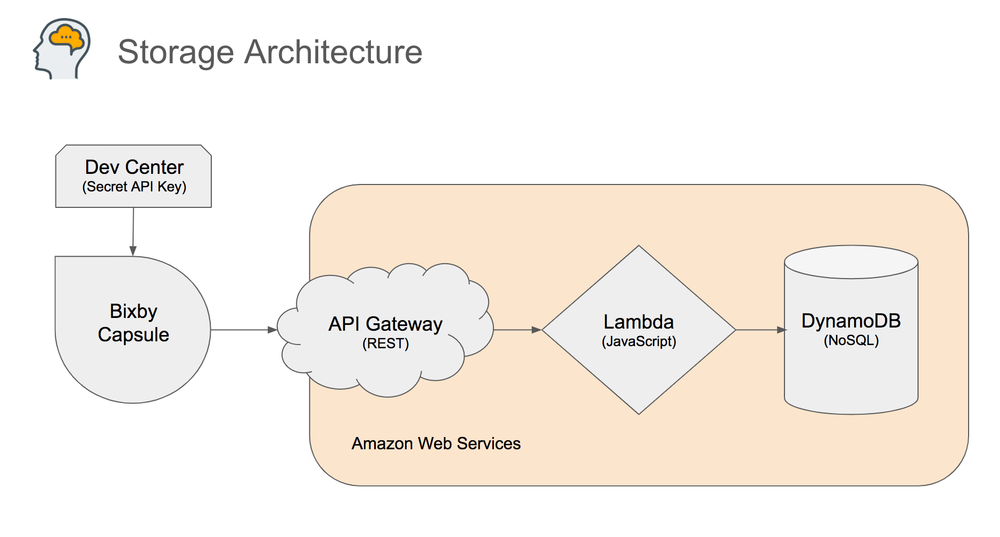

# Lambda on AWS for My Brain Bixby Capsule

This is half of an active Bixby Capsule in the marketplace, called "My Brain". This repo contains the AWS Lambda
code. The Bixby capsule code is stored in the [van.memory](https://github.com/vboughner/van.memory) repo.

## Storage Architecture

This repo contains code that runs in the Amazon Web Services lambda function, and it accesses the DynamoDB
for storing and retrieving memories. In the diagram below, the code is this repository is represented everything
inside the Lambda diamond.

The Dev Center, API Gateway, and Dynamo DB don't have any code of their own, but they do need configuration, see
the tutorial mentioned below for how to do this.

## Tutorial

Have a look at the [Bixby Capsule with AWS Tutorial](https://github.com/vboughner/bixby-capsule-with-aws)
for details about how to configure AWS to make a capsule work like this one. That repository includes
everything you need, and copious instructions.

This repository is under active development and may not reflect the easiest way to do everything, yet.

## Instructions

Run `yarn install` to make sure all the npm modules are loaded, including in the `src` folder.

Before this code can be deployed, you must create a lambda by the name `brain-lambda` in your AWS account.
Also, you'll need to establish an AWS layer
(see [this article](https://medium.com/@anjanava.biswas/nodejs-runtime-environment-with-aws-lambda-layers-f3914613e20e),
anr run `yarn layer` to prepare the zip file you need).

To deploy new code to the AWS lambda, you need the AWS configuration (permissions), and run `yarn deploy`

To store a memory from the command line use `yarn run memorize 'place statement text here'`

To try a question from the command line use `yarn run recall 'place question text here'`

To list all memories from the command line use `yarn run list`

To see a report of how many people are using the capsule, use `yarn run get-report`
